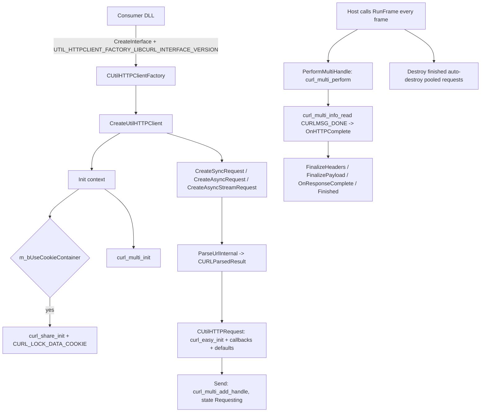

# UtilHTTPClient_libcurl

UtilHTTPClient_libcurl is a standalone HTTP client DLL backed by libcurl (multi/easy). It
implements the shared `IUtilHTTPClient` API and provides synchronous requests, asynchronous
requests, streamed responses and an optional cookie container shared across requests. Transfers are
driven by `RunFrame()` from the host's per-frame loop.

## Provenance

This repository is the standalone UtilHTTPClient_libcurl library, extracted from MetaHookSv
(`PluginLibs/UtilHTTPClient_libcurl/`) into its own CMake workspace, aligned with the standalone
Renderer, PrecacheManager and HeapPatch projects. This note was migrated from MetaHookSv
`memory/UtilHTTPClient_libcurl.md` and adapted to the new layout: the implementation moved to `src/`,
the original MSBuild project (with its injected `$(LibCurl*)` properties) was replaced by CMake with
pinned FetchContent inputs, and the upstream consumer in MetaHookSv has a standalone counterpart in
the SCModelDownloader repository. The `metahooksv` Basic Memory project belongs to the source
repository; notes here use the `utilhttpclient-libcurl` project and the
`utilhttpclient-libcurl/` permalink prefix.

## Responsibilities and entry points

- `src/UtilHTTPClient_libcurl.cpp`: the entire implementation — request creation and pooling, the
  libcurl multi pump, response accumulation and URL parsing.
- `src/dllmain.cpp`: no-op DLL entry point.
- `include/Interface/IUtilHTTPClient.h`: the shared public contract (`IUtilHTTPClient`,
  `IUtilHTTPRequest`, `IUtilHTTPResponse`, `IUtilHTTPCallbacks`, `IURLParsedResult`,
  `CUtilHTTPClientCreationContext`, `UtilHTTPMethod`, `UtilHTTPRequestState`) and the version macros.
- `tests/RegressionTests.cpp`: local-server regression tests (sockets + libcurl) exercised through
  CTest.

Exported interfaces:

| Export | Version string | Macro |
| --- | --- | --- |
| `EXPOSE_INTERFACE(CUtilHTTPClient, IUtilHTTPClient, ...)` | `UtilHTTPClient_libcurl_007` | `UTIL_HTTPCLIENT_LIBCURL_INTERFACE_VERSION` |
| `EXPOSE_SINGLE_INTERFACE(CUtilHTTPClientFactory, IUtilHTTPClientFactory, ...)` | `UtilHTTPClientFactory_libcurl_007` | `UTIL_HTTPCLIENT_FACTORY_LIBCURL_INTERFACE_VERSION` |

The public header declares both the libcurl and the SteamAPI version strings, so the same header
serves both backends; the two repositories ship slightly different copies.

## Architecture



Implementation layers (all in `src/UtilHTTPClient_libcurl.cpp`):

- **Client**: `CUtilHTTPClient` owns `CURLM* m_CurlMultiHandle`, the optional shared `CURLSH*`
  cookie handle, and the request pool (`unordered_map<UtilHTTPRequestId_t, IUtilHTTPRequest*>`
  guarded by `m_RequestHandleLock`). `RunFrame()` first pumps the multi handle, then walks the pool
  and calls `Destroy()` + erases every request that is `IsFinished()` and
  `IsAutoDestroyOnFinish()`.
- **Request family**: `CUtilHTTPRequest` wraps one `CURL*` easy handle and owns a
  `CUtilHTTPResponse`; `CUtilHTTPSyncRequest` adds the completion condition variable,
  `CUtilHTTPAsyncRequest` is the plain fire-and-forget wrapper, and `CUtilHTTPAsyncStreamRequest`
  overrides the write callback so each chunk reaches `IUtilHTTPCallbacks::OnReceiveData()`.
- **Response family**: `CUtilHTTPResponse` keeps one `CUtilHTTPPayload` for headers and one for the
  body; `FinalizeHeaders()` parses the header lines into a queryable map, `Finalize()` captures the
  body string.
- **URL parsing**: `ParseUrlInternal()` returns a `CURLParsedResult` (`IURLParsedResult`) with
  scheme/host/port/target/secure.

Behaviour worth knowing:

- Easy-handle defaults: `CONNECTTIMEOUT_MS` and `TIMEOUT_MS` are 60000, `ACCEPT_ENCODING("")`
  enables transparent decompression, `COOKIEFILE("")` turns the cookie engine on, and when cookie
  sharing is enabled `CURLOPT_SHARE` points at the shared handle. Method mapping covers
  GET/POST/PUT/DELETE/HEAD, and every request starts with a `Host` and a hard-coded Chrome
  `User-Agent` (overridable with `SetField`).
- `Send()` only adds the easy handle to the multi handle and reports the `Requesting` state; nothing
  progresses until the host pumps `RunFrame()`.
- `WriteHeaderCallback()` calls `OnRespondStart()` before the first header is stored, which is what
  moves the request into the `Responding` state; the streaming variant calls `FinalizeHeaders()`
  before the first `OnReceiveData()` so headers are already queryable inside the stream callback.
- Completion runs `FinalizeHeaders()` → `FinalizePayload()` → `OnResponseComplete()` →
  `OnRespondFinish()` → state `Finished`.
- The request pool assigns incrementing ids (`AddToRequestPool`) and exposes `GetRequestById()` /
  `DestroyRequestById()` for cross-frame lookup and teardown.

## Dependencies

- **libcurl**: shared build from `CURL_SOURCE_PATH` (pinned) with Windows Schannel and HTTPS; the
  build deliberately disables external compression, HTTP/2, SSH, PSL and IDN2. Linked as
  `CURL::libcurl` and installed as `libcurl.dll` (`libcurl-d.dll` for Debug) next to the game
  executable.
- **MetaHook SDK**: the interface base and factory macros; `include/HLSDK/common/interface.cpp` is
  compiled into this DLL, so no host launcher is built or required.
- **ScopeExit**: header-only RAII used around libcurl resources.
- **Build-only inputs, all read-only**: `CURL_SOURCE_PATH`, `METAHOOK_SOURCE_PATH`,
  `SCOPEEXIT_SOURCE_PATH`, `VC_LTL_Root` (SHA-256-verified VC-LTL 5.3.1 in `thirdparty/cache`).
  C++20, static MSVC CRT, Windows MSVC x86 only.
- **No game integration**: the library uses no engine gamedata and needs no `plugins.lst` entry —
  consumers load it through `CreateInterface`.

## Repository layout

- `src/UtilHTTPClient_libcurl.cpp`, `src/dllmain.cpp` — implementation and entry point.
- `include/Interface/IUtilHTTPClient.h` — public header (shipped with the sources, not installed).
- `tests/RegressionTests.cpp` — regression suite run by CTest.
- `CMakeLists.txt`, `cmake/Curl.cmake`, `cmake/Dependencies.cmake`, `cmake/VCLTL.cmake` — build and
  dependency pinning (including the trimmed libcurl feature set).
- `scripts/build-UtilHTTPClient_libcurl-x86-{Debug,Release}.bat`,
  `scripts/Package-Windows.ps1` — build/test/install and packaging entry points.
- `README.md`, `README.zh-CN.md`, `licenses/` — documentation and third-party terms.

## Build and data flow

`scripts/build-UtilHTTPClient_libcurl-x86-{Debug,Release}.bat` configures, builds, runs CTest,
installs and verifies the installed DLL, stopping on failure; `BUILD_TESTING` defaults to `ON`
(`-DBUILD_TESTING=OFF` for a library-only build). The first configure fetches curl, the MetaHook
interface code and ScopeExit at pinned commits unless the corresponding `*_SOURCE_PATH` / `VC_LTL_Root`
overrides are given for offline builds.
Install output is `install/x86/<Configuration>/`:

```text
libcurl.dll                                   (libcurl-d.dll for Debug, next to the game executable)
svencoop/metahook/dlls/UtilHTTPClient_libcurl.dll + .pdb
```

The install rules for the public header, licenses and READMEs were removed, so the install tree
and the release archive carry only this runtime payload. The public header lives in the
repository's `include/Interface/`, and licenses stay in the repository's `licenses/`; neither is
installed or packaged. Nothing is deployed into a game automatically.
`scripts/Package-Windows.ps1` produces the distributable archive from `libcurl.dll` and `svencoop/`.

## Notes

- A synchronous request is not self-driving: `WaitForComplete()` only waits on the condition
  variable that the multi pump signals, so either another thread must keep calling `RunFrame()`, or
  the caller should poll `IsFinished()` instead of blocking. This is expected behavior, not a bug.
- Callback ownership is inverted: the `CUtilHTTPRequest` destructor calls
  `m_Callbacks->Destroy()`, so callbacks must be heap objects owned by the request whose `Destroy()`
  deletes them. Stack-allocated or shared callbacks will break.
- `CUtilHTTPAsyncRequest::WaitForComplete()` / `WaitForCompleteTimeout()` are stubs and
  `GetResponse()` returns `nullptr`; asynchronous requests must consume results through callbacks.
- URL parsing is asymmetric, as the README documents: the regex matches case-insensitively, but the
  default-port and `secure` decisions compare the scheme case-sensitively, and `secure` is only set
  when no explicit port was supplied. IPv6 literals are rejected (the host group excludes `:`). Use
  lowercase HTTPS URLs without an explicit port.
- When a transfer fails before any response header arrives, the completion callback still fires
  while `IsFinished()` may stay false; such async requests are not reclaimed automatically by
  `RunFrame()` and need manual pool cleanup.
- Requests created for the same client share the multi handle and, when enabled, the cookie
  container; the pool lock (`m_RequestHandleLock`) protects pool access but not the request objects'
  individual state.

## Callers (optional)

- The SCModelDownloader plugin loads `UtilHTTPClient_libcurl.dll` first and falls back to
  `UtilHTTPClient_SteamAPI.dll`, obtaining the factory by version string and pumping
  `RunFrame()` from its own `HUD_Frame`.
- Any module that needs HTTP without being tied to Steamworks can use the same factory/`Init`/
  `RunFrame` contract.

## External documentation

`README.md` is the English landing page and `README.zh-CN.md` the Chinese one; both cover the quick
start, the pinned dependency overrides and the known limitations. Third-party terms are under
`licenses/` in the repository; the release archive ships the runtime payload only.
